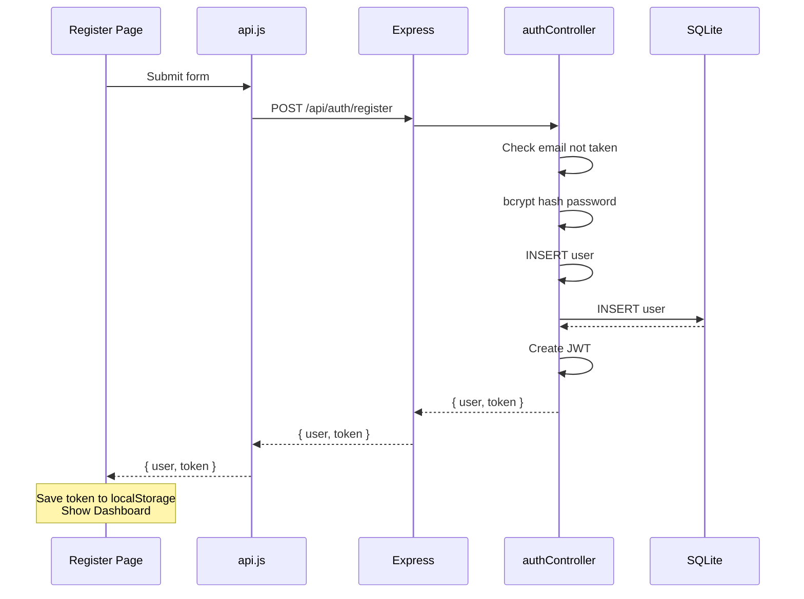

# BasicAuth

> A tiny app where you can register an account, sign in, and see your profile. That's it — no todo lists, no library management. Just authentication, explained end to end.

Use this to learn how login and registration actually work: how passwords get hashed (so they can't be stolen), how tokens prove who you are, and how the frontend remembers you're logged in even after you refresh the page.

---

## What You'll Learn

- How **bcrypt hashing** works — why we never store passwords in plain text
- What a **JWT (JSON Web Token)** is and why we use it instead of just storing a user ID
- How **middleware** protects routes — checking a token before letting a request through
- How the frontend stores the token in **localStorage** and sends it with every request
- The difference between a **401 Unauthorized** and a **409 Conflict** error

---

## Before You Start

- [ ] Node.js v20 or newer? Run `node --version`
- [ ] Have a terminal and a browser?
- [ ] 5 minutes of patience? First install downloads packages for both backend and frontend.

---

## How Do I Run It?

```bash
# 1. Go into the project
cd BasicAuth

# 2. Install everything (one time)
npm install
npm install --prefix client

# 3. Start the app
npm run dev
```

This starts two things at once:
- **Backend** (Express API) on `http://localhost:3000`
- **Frontend** (React page) on `http://localhost:5173`

Open the browser at `http://localhost:5173`. You'll see the login page. Register an account, then log in!

> **Heads up:** If you get a port conflict (EADDRINUSE), change `PORT` in `.env` to `3001` and update `client/vite.config.js` to proxy to the new port. More details in the troubleshooting section below.

---

## What's in Here?

```
BasicAuth/
├── .env                        # Secret settings (PORT, JWT_SECRET)
├── server.js                   # The Express server — the entry point
├── package.json                # Backend dependencies and scripts
├── .gitignore
│
├── config/
│   └── db.js                   # Sets up SQLite, creates the users table
│
├── models/
│   └── User.js                 # Talks to the users table in the database
│
├── controllers/
│   ├── authController.js       # Handles register, login, and "who am I?"
│   └── databaseController.js   # Debug: shows every row in every table
│
├── middleware/
│   └── auth.js                 # Checks that the JWT token is valid
│
├── routes/
│   └── routes.js               # Wires URLs to controller functions
│
└── client/                     # The React frontend (separate little app)
    ├── package.json
    ├── index.html
    ├── vite.config.js          # Tells Vite to proxy /api to the backend
    └── src/
        ├── main.jsx            # Loads the app, adds Bootstrap CSS
        ├── App.jsx             # Auth logic + route setup
        ├── App.css             # All styles
        ├── api.js              # How the frontend talks to the backend
        └── pages/
            ├── Login.jsx       # "Sign in" form
            ├── Register.jsx    # "Create account" form
            └── Dashboard.jsx   # Profile page after login
```

---

## How Does It Work?

### The big picture

You fill out a form in the browser. The browser sends it to the backend. The backend checks things, saves data, and sends back a response. The browser shows you what happened.

### Registration flow



1. You type your name, email, and password into the **Register** form.
2. The frontend sends `POST /api/auth/register` with that data.
3. The backend checks if the email is already taken — if yes, it says "nope" (409 Conflict).
4. It hashes the password using **bcryptjs** (one-way encryption — nobody, not even the server, can read the original password back).
5. It saves the user in the SQLite database.
6. It creates a **JWT** (a JSON Web Token — think of it as a digital ID card) and sends it back with the user info.
7. The frontend saves the JWT in `localStorage` and shows the dashboard.

### Login flow

1. You type your email and password into the **Login** form.
2. The frontend sends `POST /api/auth/login`.
3. The backend looks up the email, compares the hashed password using bcrypt.
4. If it matches, it creates a new JWT and sends it back.
5. Same as registration — JWT gets saved, dashboard appears.

### Checking who you are (on page refresh)

Every time the app loads, it checks `localStorage` for a saved JWT. If it finds one, it calls `GET /api/auth/me` with the token in the `Authorization` header. If the token is still valid, the user sees the dashboard. If not (expired or tampered with), it clears the token and shows the login page.

### Logout

The frontend just deletes the JWT from `localStorage`. The user is "logged out" because they no longer have the ID card. The backend doesn't need to do anything.

---

## The Database

Table: `users`

| Column | Type | Notes |
|--------|------|-------|
| id | INTEGER | Auto-increment |
| name | TEXT | User's full name |
| email | TEXT | Unique — no two users can share the same email |
| password | TEXT | The bcrypt hash (NOT the original password!) |
| created_at | TEXT | Auto-filled with current datetime |

> **Important:** The `password` column stores the **hashed** version of the password, never the original. Even if someone accesses the database directly, they can't see the actual passwords. A bcrypt hash looks like `$2a$10$N9qo8uLOickgx2ZMRZoMye...` — it's mathematically impossible to reverse.

---

## API Endpoints

| Method | URL | Auth? | What it does |
|--------|-----|-------|-------------|
| POST | `/api/auth/register` | No | Create an account. Returns `{ user, token }`. |
| POST | `/api/auth/login` | No | Sign in. Returns `{ user, token }`. |
| GET | `/api/auth/me` | Yes | Get the current user's info. Requires `Authorization: Bearer <token>`. |
| GET | `/api/database` | No | Debug — shows every row in the database (includes password hashes). |

---

## Try It With curl

You can test the API with `curl` (or Postman, or the browser forms).

### Register

```bash
curl -X POST http://localhost:3000/api/auth/register \
  -H "Content-Type: application/json" \
  -d '{"name": "Alice", "email": "alice@test.com", "password": "secret123"}'
```

Response:

```json
{
  "user": { "id": 1, "name": "Alice", "email": "alice@test.com", "created_at": "2026-05-29 15:55:27" },
  "token": "eyJhbGciOiJIUzI1NiIs..."
}
```

### Login

```bash
curl -X POST http://localhost:3000/api/auth/login \
  -H "Content-Type: application/json" \
  -d '{"email": "alice@test.com", "password": "secret123"}'
```

### Get current user (replace TOKEN with the actual token from login/register)

```bash
curl http://localhost:3000/api/auth/me \
  -H "Authorization: Bearer TOKEN"
```

### Error cases

```bash
# Duplicate email (409 Conflict)
curl -X POST http://localhost:3000/api/auth/register \
  -H "Content-Type: application/json" \
  -d '{"name": "Alice Again", "email": "alice@test.com", "password": "secret123"}'

# Wrong password (401 Unauthorized)
curl -X POST http://localhost:3000/api/auth/login \
  -H "Content-Type: application/json" \
  -d '{"email": "alice@test.com", "password": "wrongpassword"}'

# Invalid token (401 Unauthorized)
curl http://localhost:3000/api/auth/me \
  -H "Authorization: Bearer fakenottherealtoken"
```

**Why does "wrong password" and "email not found" give the same error?** It's intentional. The error doesn't say "email not found" or "wrong password" separately, because that would tell an attacker whether an email is registered. Security through vagueness.

---

## Tech Stack

| Package | What It Does | Why We Use It |
|---------|-------------|---------------|
| express | HTTP server | Simple, widely used, great for learning |
| better-sqlite3 | Talks to SQLite | Synchronous — no async/await needed |
| bcryptjs | Password hashing | Pure JavaScript, no native dependencies to compile |
| jsonwebtoken | Creates and verifies JWTs | Standard way to handle authentication |
| react | UI library | Builds the forms and dashboard |
| bootstrap | CSS framework | Clean forms and layout without writing raw CSS |
| vite | Frontend dev server | Fast, proxies API calls to backend |
| nodemon | Auto-restarts server on save | Dev convenience |
| concurrently | Runs backend + frontend together | One terminal, two servers |

---

## Customization Guide

### Add a "phone number" field to the user profile

1. **Add a column to the database** — edit `config/db.js` and add a `phone` column to the users table:
   ```sql
   ALTER TABLE users ADD COLUMN phone TEXT NULL;
   ```
   Or just add it to the CREATE TABLE statement and delete the database file to recreate it.

2. **Update the User model** — in `models/User.js`, add `phone` to the `update` method.

3. **Update the authController** — in `controllers/authController.js`, include `phone` in the `updateProfile` handler.

4. **Update the Dashboard page** — in `client/src/pages/Dashboard.jsx`, add a phone input to the profile form.

5. **Test it** — register a new user, then update their profile with a phone number.

### Change the JWT expiry time

1. **Open `controllers/authController.js`** and find the `jwt.sign()` call.
2. Change `expiresIn: '7d'` to whatever you want — `'1d'` for 1 day, `'30d'` for 30 days, `'1h'` for 1 hour.
3. **Note:** The current default is 7 days. After a token expires, users must log in again to get a new one.

---

## Challenge Yourself

- 🟢 **Easy:** Register two accounts with the same email — see the 409 Conflict error first-hand.
- 🟢 **Easy:** Open browser DevTools (F12) → Application → Local Storage and look for the `token` key. Modify one character of the token and refresh — the app boots you back to login.
- 🟡 **Medium:** Add a "Change Password" feature — new form on the Dashboard, new endpoint `PUT /api/auth/change-password` that verifies old password before updating.
- 🟡 **Medium:** Add a `phone` field to the registration form (see customization guide above).
- 🔴 **Hard:** Add email verification — send a code to the user's email (or simulate it by logging the code to the terminal) that they must enter before their account is activated.

---

## Troubleshooting

| Error | What It Means | What To Try |
|-------|--------------|-------------|
| `EADDRINUSE: address already in use :::3000` | Another app is using port 3000 | Close the other process, or change `PORT` in `.env` to `3001` — also update `client/vite.config.js` proxy target |
| `EADDRINUSE` on port 5173 | Another Vite app is running | Stop the other one, or Vite will auto-offer the next port |
| `Cannot find module 'bcryptjs'` | Backend deps not installed | Run `npm install` in the project root |
| `.env` changes not taking effect | `--env-file` is read at startup, not watched for changes | Stop the process (Ctrl+C) and restart it. Both `npm start` and `npm run dev` load `.env`, but `npm run dev` auto-restarts when files change. |
| Back button after logout shows Dashboard briefly | Token cached in browser history | This is a known behavior with client-side routing. The app should redirect to login after checking the token. If it persists, clear localStorage manually. |
| "Token expired" after a few days | JWT defaults to 7-day expiry | That's expected! Log in again to get a fresh token. You can change the expiry in `authController.js` (see customization guide). |
| `Cannot find module 'react'` | Frontend deps not installed | Run `npm install --prefix client` |
| Blank page at `:5173` | Frontend crashed or build error | Check the terminal running Vite for error messages |
| Wrong password gives "Invalid email or password" | Email doesn't exist OR password is wrong | This is intentional — the same error for both cases protects user privacy. Try registering a fresh account. |

---

## What Should I Do Next?

1. **Read `middleware/auth.js`** — it's only ~15 lines. See how JWT verification works.
2. **Read `controllers/authController.js`** — trace the register and login functions step by step.
3. **Open browser DevTools → Network tab** while logging in and watch the login request go out. See the token come back in the response.
4. **Ready for more?** Move on to **BasicCrudTODOApp** — it builds on auth patterns and adds full CRUD operations with a SQLite database.

---

## Production-ish Notes (optional)

- In production, use a **strong, random `JWT_SECRET`** — the one in `.env` is a placeholder. Use a tool like `openssl rand -hex 64` to generate one.
- JWTs stored in `localStorage` are vulnerable to XSS attacks. In a real production app, you'd use HTTP-only cookies instead. This project uses localStorage for simplicity — it's easier to inspect and debug.
- Never commit `.env` to git — the `.gitignore` already protects it.

---

*"Your first time running this and it crashes? That's normal. Every programmer you look up to started exactly where you are now — staring at a terminal, confused, one Google search away from figuring it out."*

Happy coding!
