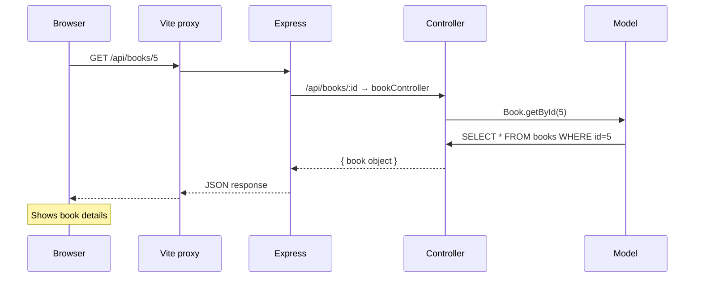
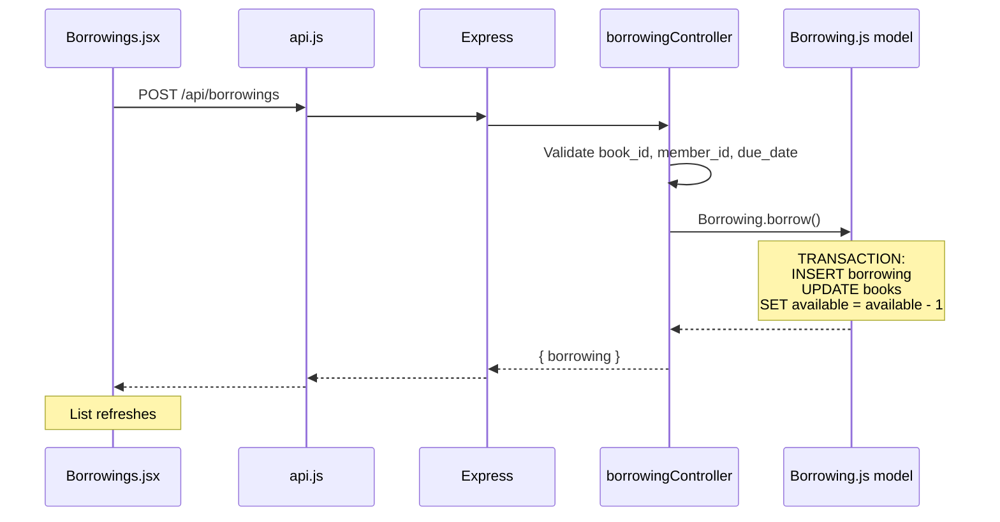
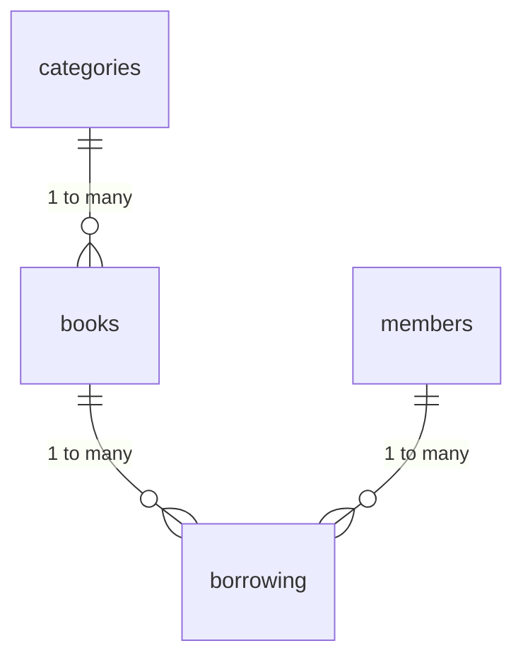

# Library Management System

> A library app where you can add books, register members, and track who borrowed what. Four database tables, search endpoints, and borrowing logic with automatic overdue detection. Backend is Express + SQLite. Frontend is React + Bootstrap.

Don't worry if you've never set up a full-stack app before. Follow the steps below and you'll be up in a couple minutes. If something breaks — that's normal. Read the error, check the notes at the bottom, try again. You've got this.

---

## What You'll Learn

- How to design a **multi-table database** with foreign keys — categories, books, members, borrowings all linked together
- How to handle **quantity tracking** — every book has `total_quantity` and `available_quantity`, and they stay in sync
- How to use **database transactions** for borrow/return operations (borrow a book → decrement available, return it → increment back)
- How **route ordering matters** — why `/search` must come before `/:id` in your routes file
- How to handle **computed states** — overdue status is calculated dynamically, not stored permanently

---

## Before You Start

- [ ] Node.js v20 or newer? Run `node --version`
- [ ] Have a terminal and a browser?
- [ ] 5 minutes of patience? Two install steps (backend + frontend).

---

## How Do I Run It?

Open a terminal in the `LibrarySystem/` folder and run:

```bash
# 1. Install backend stuff
npm install

# 2. Install frontend stuff
npm install --prefix client

# 3. Start everything
npm run dev
```

That's it. Open **http://localhost:5173** in your browser.

The backend API runs on `http://localhost:3000` — that's where the data lives. The frontend runs on `http://localhost:5173` and talks to the backend automatically through Vite's proxy. You don't need to think about it.

> **Important:** This app has **no login or auth**. Anyone can access everything. This is by design — it keeps the code focused on CRUD operations and borrowing logic. For production, you'd add an auth layer (check out the **BasicAuth** project for that pattern!).

### Other ways to run it

| Command | What it does |
|---------|-------------|
| `npm start` | Backend only (for deployment) |
| `npm run dev:api` | Backend only, auto-restarts when you edit code |
| `npm run dev:web` | Frontend only (the Vite dev server) |

---

## What's in Here?

```
LibrarySystem/
├── server.js                     # The file that starts the whole API
├── package.json                  # List of backend packages + run scripts
├── .env                          # PORT=3000 (change it if you need a different port)
├── .gitignore
│
├── config/
│   └── db.js                     # Connects to SQLite + creates all tables automatically
│
├── models/                       # Each file = one table in the database
│   ├── Category.js               #   get all, get one, create, update, delete
│   ├── Book.js                   #   CRUD + search, quantity tracking
│   ├── Member.js                 #   CRUD + search
│   └── Borrowing.js              #   borrow, return, overdue check logic
│
├── controllers/                  # Handle HTTP requests — validate, call model, send response
│   ├── categoryController.js
│   ├── bookController.js
│   ├── memberController.js
│   ├── borrowingController.js
│   └── databaseController.js     # Returns every table's data — handy for debugging
│
├── routes/
│   └── routes.js                 # Maps URLs (like /api/books) to the right controller
│
├── database/                     # SQLite database auto-created here
│
└── client/                       # The React frontend (a whole separate project inside this one)
    ├── package.json              #   Frontend packages
    ├── index.html                #   The HTML page
    ├── vite.config.js            #   Tells Vite to send /api calls to the backend
    └── src/
        ├── main.jsx              #   Where React starts
        ├── App.jsx               #   Sidebar + page routing
        ├── App.css               #   All the styles
        ├── api.js                #   How the frontend talks to the backend
        └── pages/
            ├── Dashboard.jsx     #   Overview with numbers
            ├── Categories.jsx    #   Manage categories
            ├── Books.jsx         #   Manage books + search
            ├── Members.jsx       #   Manage members + search
            └── Borrowings.jsx    #   Borrow & return books
```

---

## How Does It Work?

### The request lifecycle

Every API request follows the same path:



### Borrowing flow (the fun part)



**Key detail:** When you borrow a book, the code uses a database transaction to:
1. Insert the borrowing record
2. Decrease `available_quantity` by 1

Both happen together or neither happens. No book can be borrowed into negative quantities.

### Overdue detection

The `GET /api/borrowings/overdue` endpoint uses a `CASE WHEN` computed column in its SQL query — it compares `due_date` against `date('now')` and returns `'overdue'` as the `calculated_status` when a book is overdue. It never writes to the `status` column in the database. This is a design choice: the overdue status is calculated dynamically on read, not stored permanently. No GET request modifies data — it's all computed on the fly.

### Form data types

When the frontend sends data to the backend (e.g., creating a book), it sends **strings** in JSON. The controller must convert them to the right types before passing them to the model. For example:
- `category_id` comes as a string `"1"` → converted to integer `1` with `Number()`
- `total_quantity` comes as `"5"` → converted to integer `5`

If the controller forgets to convert, SQLite might silently accept the string, which can cause weird behavior later. The controllers in this project handle conversions — but it's something to watch for when you customize the code.

---

## The Database

Four tables, linked by foreign keys.

### Table: `categories`

| Column | Type | Notes |
|--------|------|-------|
| id | INTEGER | Auto-increment |
| name | TEXT | Unique |
| description | TEXT | Optional |
| created_at | TEXT | Auto-filled |
| updated_at | TEXT | Auto-filled |

### Table: `books`

| Column | Type | Notes |
|--------|------|-------|
| id | INTEGER | Auto-increment |
| title | TEXT | Required |
| author | TEXT | Required |
| isbn | TEXT | Unique |
| publisher | TEXT | Optional |
| publication_year | INTEGER | Optional |
| category_id | INTEGER | Links to `categories.id` |
| total_quantity | INTEGER | Total copies owned (default 1) |
| available_quantity | INTEGER | Copies not currently borrowed (default 1) |
| created_at | TEXT | Auto-filled |
| updated_at | TEXT | Auto-filled |

> **Important:** `available_quantity` must always be ≤ `total_quantity`. The borrow/return logic enforces this. Never set `available_quantity` higher than `total_quantity` directly.

### Table: `members`

| Column | Type | Notes |
|--------|------|-------|
| id | INTEGER | Auto-increment |
| name | TEXT | Required |
| email | TEXT | Unique |
| phone | TEXT | Optional |
| address | TEXT | Optional |
| membership_date | TEXT | Auto-filled with today's date |
| created_at | TEXT | Auto-filled |
| updated_at | TEXT | Auto-filled |

### Table: `borrowing` (singular — note the table name!)

| Column | Type | Notes |
|--------|------|-------|
| id | INTEGER | Auto-increment |
| book_id | INTEGER | Links to `books.id` |
| member_id | INTEGER | Links to `members.id` |
| borrow_date | TEXT | Auto-filled with today's date |
| due_date | TEXT | Required — when the book must be returned |
| return_date | TEXT | NULL until returned |
| status | TEXT | One of: `borrowed`, `returned`, `overdue` |
| created_at | TEXT | Auto-filled |
| updated_at | TEXT | Auto-filled |

### Relationships



---

## API Endpoints

### Categories

| Method | Endpoint | What it does |
|--------|----------|-------------|
| GET | `/api/categories` | List all |
| GET | `/api/categories/:id` | Get one |
| POST | `/api/categories` | Create `{ name, description? }` |
| PUT | `/api/categories/:id` | Update |
| DELETE | `/api/categories/:id` | Delete |

### Books

| Method | Endpoint | What it does |
|--------|----------|-------------|
| GET | `/api/books` | List all (includes `category_name` via JOIN) |
| GET | `/api/books/search?q=` | Search by title, author, or ISBN |
| GET | `/api/books/:id` | Get one |
| POST | `/api/books` | Create `{ title, author, isbn, category_id?, total_quantity? }` |
| PUT | `/api/books/:id` | Update |
| DELETE | `/api/books/:id` | Delete |

### Members

| Method | Endpoint | What it does |
|--------|----------|-------------|
| GET | `/api/members` | List all |
| GET | `/api/members/search?q=` | Search by name or email |
| GET | `/api/members/:id` | Get one |
| POST | `/api/members` | Register `{ name, email, phone?, address? }` |
| PUT | `/api/members/:id` | Update |
| DELETE | `/api/members/:id` | Delete |

### Borrowings

| Method | Endpoint | What it does |
|--------|----------|-------------|
| GET | `/api/borrowings` | List all |
| GET | `/api/borrowings/overdue` | List overdue borrowings (updates status on read) |
| GET | `/api/borrowings/:id` | Get one |
| GET | `/api/borrowings/by-member/:memberId` | Get by member |
| GET | `/api/borrowings/by-book/:bookId` | Get by book |
| POST | `/api/borrowings` | Borrow a book `{ book_id, member_id, due_date }` |
| PUT | `/api/borrowings/:id/return` | Return a book |

### Debug

| Method | Endpoint | What it does |
|--------|----------|-------------|
| GET | `/api/database` | Returns every table's data |

> **Route ordering reminder:** `/api/borrowings/overdue` and `/api/borrowings/by-member/:memberId` must come BEFORE `/api/borrowings/:id` in `routes.js`. If `/:id` comes first, Express will try to match "overdue" as an ID number!

---

## Try It With curl

You can test the API with `curl` in a terminal (keep the server running in another terminal).

### Add a category

```bash
curl -X POST http://localhost:3000/api/categories \
  -H "Content-Type: application/json" \
  -d '{"name": "Fiction", "description": "Fiction books"}'
```

### Add a book

```bash
curl -X POST http://localhost:3000/api/books \
  -H "Content-Type: application/json" \
  -d '{"title": "Dune", "author": "Frank Herbert", "isbn": "9780441013593", "category_id": 1, "total_quantity": 5}'
```

> **Note:** `category_id` is sent as an integer here (not a string like `"1"`). This works because curl sends valid JSON. But when you use the frontend forms, the values come as strings and the controller converts them.

### Register a member

```bash
curl -X POST http://localhost:3000/api/members \
  -H "Content-Type: application/json" \
  -d '{"name": "Alice", "email": "alice@example.com"}'
```

### Borrow a book

```bash
curl -X POST http://localhost:3000/api/borrowings \
  -H "Content-Type: application/json" \
  -d '{"book_id": 1, "member_id": 1, "due_date": "2026-06-15"}'
```

### Return a book

```bash
curl -X PUT http://localhost:3000/api/borrowings/1/return
```

### See overdue books

```bash
curl http://localhost:3000/api/borrowings/overdue
```

### Search for a book

```bash
curl "http://localhost:3000/api/books/search?q=dune"
```

### Search for a member

```bash
curl "http://localhost:3000/api/members/search?q=alice"
```

### See everything in the database

```bash
curl http://localhost:3000/api/database | python3 -m json.tool
```

---

## Tech Stack

| Package | What It Does | Why We Use It |
|---------|-------------|---------------|
| express | HTTP server | Simple, widely used, great for learning |
| better-sqlite3 | Talks to SQLite | Synchronous — no async/await needed |
| cors | Cross-origin requests | So the browser can talk to the API |
| react | UI library | Builds the admin panel |
| react-router-dom | Client-side routing | Sidebar navigation between pages |
| bootstrap | CSS framework | Clean tables and forms (CSS only, no JS) |
| vite | Frontend dev server + build | Fast, proxies `/api` to backend |
| nodemon | Auto-restarts server on save | Dev convenience |
| concurrently | Runs backend + frontend together | One terminal, two servers |

---

## Customization Guide

### Add an author search filter

1. **Open `models/Book.js`** and add a new `searchByAuthor` method:
   ```js
   searchByAuthor(author) {
     return db.prepare(
       'SELECT books.*, categories.name AS category_name FROM books LEFT JOIN categories ON books.category_id = categories.id WHERE books.author LIKE ?'
     ).all(`%${author}%`);
   }
   ```
2. **Open `controllers/bookController.js`** and add a handler:
   ```js
   searchByAuthor(req, res) {
     try {
       const { q } = req.query;
       if (!q) return res.json(Book.getAll());
       res.json(Book.searchByAuthor(q));
     } catch (err) {
       res.status(500).json({ error: err.message });
     }
   }
   ```
3. **Open `routes/routes.js`** and add:
   ```js
   router.get('/books/search/author', bookController.searchByAuthor);
   ```
   Put it BEFORE the `/books/:id` route!
4. **Test it:** `curl "http://localhost:3000/api/books/search/author?q=Frank"`

### Add a "fine" system for overdue books

1. **Add a `fine_per_day` column** to the database schema
2. **Update the overdue endpoint** to calculate fines based on days overdue
3. **Add a "Pay Fine" button** in the UI

---

## Challenge Yourself

- 🟢 **Easy:** Add a `publisher` field to the book creation form and display it in the book list.
- 🟢 **Easy:** Sort the borrowing list so overdue items appear at the top (hint: modify the SQL query).
- 🟡 **Medium:** Add a **book availability indicator** on the dashboard — green if available > 0, red if 0.
- 🟡 **Medium:** Add a **borrowing history** filter — show only returned, only borrowed, or only overdue.
- 🔴 **Hard:** Add **user authentication** with two roles (librarian vs member). Librarians manage everything. Members can only view their own borrowings. Use patterns from the **BasicAuth** project.

---

## Troubleshooting

| Error | What It Means | What To Try |
|-------|--------------|-------------|
| `EADDRINUSE` on port 3000 | Another app is using that port | Kill the other process or change `PORT` in `.env` to 3001 — also update `client/vite.config.js` |
| `EADDRINUSE` on port 5173 | Another Vite app is running | Stop it, or Vite will auto-offer the next port |
| `Connection refused` in curl | Server isn't running | Run `npm run dev` first. We've all forgotten this. |
| 500 error | Something broke on the backend | Read the error in the terminal. Every word matters. Check the JSON response too. |
| Blank page in browser | Frontend not loading | Make sure you're on `http://localhost:5173` (not `:3000`). If page loads but no data, check the API terminal. |
| `Cannot find module 'react'` | Frontend deps not installed | Run `npm install --prefix client` |
| `Cannot find module 'better-sqlite3'` | Backend deps not installed | Run `npm install` in project root |
| Book quantity goes negative | Borrow logic might have a bug | The transaction should check `available_quantity > 0` before allowing a borrow. If you see negative numbers, check the `Borrowing.borrow()` model. |
| Form sends strings to number columns | Frontend sends `"1"` instead of `1` | This is normal — HTTP form data is always strings. The controllers handle the conversion with `Number()`. If you add a new numeric field, make sure to convert it in the controller. |
| Overdue books don't show as overdue | Overdue status is computed dynamically, not stored | Go to `http://localhost:3000/api/borrowings/overdue` in curl or click "Overdue" in the app. The status is computed via a `CASE WHEN` SQL expression — no data is modified. |
| Delete category fails | Books still reference the category | You must delete (or reassign) all books in that category before deleting the category. |

---

## What Should I Do Next?

1. **Read `models/Borrowing.js`** — see how the borrow and return transactions work. It's the most interesting code in the project.
2. **Read `routes/routes.js`** — notice the route ordering. Why is `GET /api/borrowings/overdue` before `GET /api/borrowings/:id`?
3. **Trace a borrow+return cycle** with curl. Watch how `available_quantity` changes.
4. **Ready for more?** Try **ECommerce** — it has 6 tables, role-based auth, image uploads, and a shopping cart with transactional checkout.

---

## Production-ish Notes (optional)

- The overdue check uses a computed `CASE WHEN` column — the status is calculated dynamically, never stored. This is fine for a small school project. In a real app, you'd still calculate overdue status in the SQL query (same approach) or run a scheduled job to cache the result for performance.
- No authentication means anyone can borrow or return anything. Add auth before deploying anywhere public.
- The `database/library.sqlite` file is auto-created. Back it up before making big changes.

---

*"Your first time running this and it crashes? That's normal. Read the error. Google the first line. Ask someone. You're not supposed to know everything yet. Every programmer you look up to started exactly where you are now — staring at a terminal, confused, one Google search away from figuring it out."*

Happy coding!
