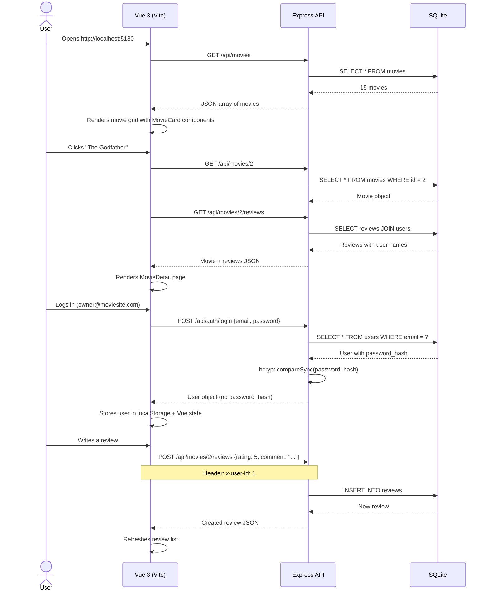

# MovieReviewSite

> A minimal movie review app — browse 15 classic films, rate them, and write reviews. Your first full-stack app with Vue 3.

This is the first BuildItRight project that adds a real frontend framework to the mix. You've already built backends with Express and SQLite — now you'll see how Vue 3 connects to that backend and turns it into something a user can actually click around in. The backend stays simple (header-based auth, no JWT), so you can focus on the new stuff: Vue reactivity, Composition API, and client-side routing.

---

## What You'll Learn

- **MVC architecture** — Models handle data, controllers handle logic, views (Vue) handle presentation. Each layer has one job.
- **Vue 3 Composition API** — `ref()`, `computed()`, `onMounted()`, and `<script setup>` for reactive state without classes or decorators.
- **Client-side routing** — Vue Router maps URLs to page components. Navigation guards protect routes by role.
- **Header-based authentication** — The client sends `x-user-id` in every request. No JWTs, no sessions — just a database lookup.
- **better-sqlite3 synchronous patterns** — No async/await needed. Database calls are blocking but predictable.
- **Computed properties and reactivity** — Vue automatically updates the DOM when your data changes. No manual DOM manipulation.
- **Role-based access control** — Owner manages movies, users write reviews. Middleware enforces it on the server, route guards enforce it on the client.

---

## Before You Start

- [ ] You've completed at least one BuildItRight backend project (ExpressServer or similar)
- [ ] Node.js 18+ is installed (`node -v` to check)
- [ ] You're comfortable reading JavaScript and have seen `async/await` before
- [ ] You understand what an API endpoint is and how HTTP requests work

---

## How Do I Run It?

```bash
# 1. Navigate to the project
cd MovieReviewSite

# 2. Install all dependencies (backend + frontend)
npm install

# 3. Start both servers at once
npm run dev
```

That's it. The backend runs on `http://localhost:3000` and the frontend on `http://localhost:5180`. Vite proxies API requests to the backend automatically.

Open `http://localhost:5180` in your browser. You'll see 15 seeded classic films.

**Demo account:** `owner@moviesite.com` / `owner123` (has access to the Dashboard)

---

## What's in Here?

```
MovieReviewSite/
├── config/
│   └── db.js              # Database connection + schema + seed data
├── controllers/
│   ├── authController.js   # Register, login, logout, /me
│   ├── movieController.js  # CRUD for movies (owner only for writes)
│   ├── reviewController.js # CRUD for reviews (auth required)
│   └── databaseController.js # Debug endpoint — row counts
├── middleware/
│   └── auth.js             # requireAuth + requireOwner middleware
├── models/
│   ├── User.js             # User queries (getById, create, etc.)
│   ├── Movie.js            # Movie queries + rating aggregation
│   └── Review.js           # Review queries with JOINs
├── routes/                 # Express route definitions
├── utils/
│   └── sanitize.js         # HTML tag stripper for user input
├── client/                 # Vue 3 frontend (Vite)
│   └── src/
│       ├── api.js          # Fetch wrapper with auth header injection
│       ├── composables/
│       │   └── useAuth.js  # Global auth state (singleton pattern)
│       ├── components/
│       │   ├── StarRating.vue   # Reusable star rating (v-model)
│       │   ├── MovieCard.vue    # Movie grid card with poster placeholder
│       │   ├── ReviewList.vue   # Review display list
│       │   └── NavBar.vue       # Navigation bar
│       ├── pages/
│       │   ├── Home.vue         # Movie grid (landing page)
│       │   ├── MovieDetail.vue  # Single movie + reviews
│       │   ├── Login.vue        # Login form
│       │   ├── Register.vue     # Registration form
│       │   ├── Dashboard.vue    # Owner: manage movies
│       │   ├── MyReviews.vue    # User: manage your reviews
│       │   └── NotFound.vue     # 404 page
│       └── router/
│           └── index.js         # Vue Router + navigation guards
├── database/               # SQLite file lives here (auto-created)
├── server.js               # Express app entry point
└── package.json
```

---

## How Does It Work?



### Step by step:

1. **App starts** — `npm run dev` uses `concurrently` to start the Express server (port 3000) and Vite dev server (port 5180) at the same time.
2. **Database initializes** — `config/db.js` creates the `database/` folder if needed, opens (or creates) the SQLite file, creates tables, and seeds 15 movies if the table is empty.
3. **Vue app loads** — Vite serves the SPA. `App.vue` restores the user session from localStorage, then Vue Router renders the matched page component.
4. **API calls go through `api.js`** — Every `fetch()` call goes through the `request()` function, which adds the `x-user-id` header automatically.
5. **Auth state is global** — `useAuth()` is a composable that returns module-level refs. All components that call `useAuth()` share the same reactive state.
6. **Route guards protect pages** — Vue Router's `beforeEach` checks `meta.requiresAuth` and `meta.requiresOwner` before allowing navigation.

---

## The Database

Three tables with foreign keys and a uniqueness constraint:

### users
| Column | Type | Notes |
|--------|------|-------|
| id | INTEGER | Primary key, auto-increment |
| name | TEXT | Required |
| email | TEXT | Required, unique |
| password_hash | TEXT | bcrypt hash, never sent to client |
| role | TEXT | `'customer'` or `'owner'` |
| created_at | TEXT | Auto-set to `datetime('now')` |

### movies
| Column | Type | Notes |
|--------|------|-------|
| id | INTEGER | Primary key, auto-increment |
| title | TEXT | Required |
| description | TEXT | Defaults to empty string |
| year | INTEGER | Must be 1888–current+5 |
| genre | TEXT | Used for poster color coding |
| created_at | TEXT | Auto-set to `datetime('now')` |

### reviews
| Column | Type | Notes |
|--------|------|-------|
| id | INTEGER | Primary key, auto-increment |
| movie_id | INTEGER | FK → movies.id, CASCADE delete |
| user_id | INTEGER | FK → users.id, CASCADE delete |
| rating | INTEGER | 1–5 (CHECK constraint) |
| comment | TEXT | Required |
| created_at | TEXT | Auto-set to `datetime('now')` |
| — | — | `UNIQUE(movie_id, user_id)` — one review per user per movie |

---

## API Endpoints

| Method | Path | Auth | What it does |
|--------|------|------|-------------|
| POST | `/api/auth/register` | No | Create a new account |
| POST | `/api/auth/login` | No | Log in, returns user object |
| POST | `/api/auth/logout` | No | No-op (client clears localStorage) |
| GET | `/api/auth/me` | Yes | Returns current user |
| GET | `/api/movies` | No | All movies with avg rating + review count |
| GET | `/api/movies/:id` | No | Single movie with avg rating |
| POST | `/api/movies` | Owner | Create a movie |
| PUT | `/api/movies/:id` | Owner | Update a movie (partial) |
| DELETE | `/api/movies/:id` | Owner | Delete movie + its reviews (cascade) |
| GET | `/api/movies/:movieId/reviews` | No | All reviews for a movie |
| POST | `/api/movies/:movieId/reviews` | Yes | Write a review (one per user per movie) |
| PUT | `/api/reviews/:id` | Owner* | Edit your own review |
| DELETE | `/api/reviews/:id` | Owner* | Delete your own review |
| GET | `/api/users/:userId/reviews` | Yes | All reviews by a user |
| GET | `/api/database/status` | No | Debug: table row counts |

\* "Owner" here means the review owner (any logged-in user can edit/delete their own reviews).

---

## Try It With curl

**Get all movies:**
```bash
curl http://localhost:3000/api/movies | python3 -m json.tool
```

**Log in as owner:**
```bash
curl -X POST http://localhost:3000/api/auth/login \
  -H "Content-Type: application/json" \
  -d '{"email":"owner@moviesite.com","password":"owner123"}'
```

**Write a review (use the user ID from login response):**
```bash
curl -X POST http://localhost:3000/api/movies/1/reviews \
  -H "Content-Type: application/json" \
  -H "x-user-id: 1" \
  -d '{"rating": 5, "comment": "Masterpiece!"}'
```

**Try to review the same movie twice (should get 409):**
```bash
curl -X POST http://localhost:3000/api/movies/1/reviews \
  -H "Content-Type: application/json" \
  -H "x-user-id: 1" \
  -d '{"rating": 4, "comment": "Still great"}'
```

**Access Dashboard without owner role (should get 403):**
```bash
curl http://localhost:3000/api/movies \
  -H "x-user-id: 2" \
  -X POST \
  -H "Content-Type: application/json" \
  -d '{"title":"Test","description":"Test","year":2020,"genre":"Drama"}'
```

---

## Tech Stack

| Package | What It Does | Why We Use It |
|---------|-------------|--------------|
| `express` | HTTP server framework | Routing, middleware, JSON parsing |
| `better-sqlite3` | Synchronous SQLite driver | No async complexity — great for learning |
| `bcryptjs` | Password hashing | Hashes passwords before storing (cost 10) |
| `cors` | Cross-origin resource sharing | Lets Vite dev server talk to Express |
| `dotenv` | Load .env files | Keep config out of code |
| `concurrently` | Run multiple commands | Start frontend + backend with one command |
| `vue` | Frontend framework | Reactive UI without jQuery spaghetti |
| `vue-router` | Client-side routing | URL → component mapping, navigation guards |
| `vite` | Frontend build tool | Fast dev server with HMR (hot module replacement) |
| `bootstrap` | CSS framework | Quick styling without writing everything from scratch |

---

## Customization Guide

### 1. Add a new movie genre

In `client/src/components/MovieCard.vue`, `MovieDetail.vue`, and `Dashboard.vue`, add a new regex check to the `genreClass` computed/function:

```js
if (/\b(your.genre)\b/.test(raw)) return 'yourgenre';
```

Then add the corresponding CSS in any component's `<style>` block:

```css
.poster-yourgenre {
  background: linear-gradient(135deg, #color1, #color2);
}
.genre-yourgenre {
  background-color: #badgecolor;
}
```

### 2. Add a new API endpoint

1. Create a model function in `models/` (or reuse an existing one)
2. Create a controller function in `controllers/`
3. Add the route in `routes/`
4. Add the API method in `client/src/api.js`
5. Use it in a Vue component

### 3. Change the auth system

The current auth uses `x-user-id` headers. To switch to JWT:

1. Install `jsonwebtoken`: `npm install jsonwebtoken`
2. In `authController.js` login, generate a token: `jwt.sign({ id: user.id }, secret)`
3. In `middleware/auth.js`, verify the token instead of looking up the header
4. In `client/src/api.js`, send the token in an `Authorization: Bearer` header

---

## Challenge Yourself

🟢 **Easy:**
- Change the star rating colors from gold to a different color
- Add a "Most Reviewed" sort option to the home page
- Display the review count on the Dashboard table

🟡 **Medium:**
- Add a search bar that filters movies by title
- Add a "Top Rated" page that sorts movies by average rating
- Implement pagination for the movie list

🔴 **Hard:**
- Add image upload for movie posters (store in `public/uploads/`)
- Add a "Watchlist" feature with a new database table
- Implement real-time review counts with Server-Sent Events

---

## Troubleshooting

| Error | Cause | Fix |
|-------|-------|-----|
| `EADDRINUSE: port 3000` | Another process is using port 3000 | `lsof -i :3000` and kill it, or change PORT in `.env` |
| `SQLITE_CONSTRAINT: UNIQUE` | Trying to register with an existing email | Use a different email or log in |
| `SQLITE_CONSTRAINT: UNIQUE` | Trying to review a movie you already reviewed | Edit your existing review instead |
| `Failed to fetch` | Backend isn't running | Make sure `npm run dev` started both servers |
| Blank page at localhost:5180 | Vite hasn't finished starting | Wait a few seconds, check the terminal for errors |
| `User not found` in API calls | x-user-id header is missing or invalid | Log in again, check localStorage in browser DevTools |
| Reviews not updating | Stale data in Vue state | The app re-fetches after create/update — check the network tab |

---

## What Should I Do Next?

Build [**TaskManager**](../TaskManager) — adds task CRUD with categories, drag-and-drop reordering, and localStorage persistence. You'll practice more Vue patterns and learn about client-side state management.

---

*"Your first time running this and it crashes? That's normal. Every programmer you look up to started exactly where you are now — staring at an error message, wondering what they did wrong. The answer is almost always a missing comma, a wrong port, or a typo. You've got this."*
