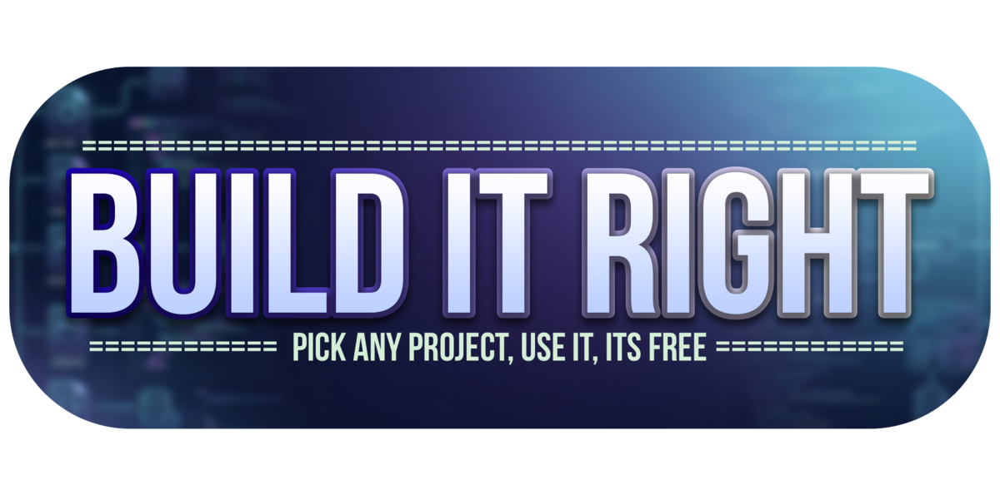
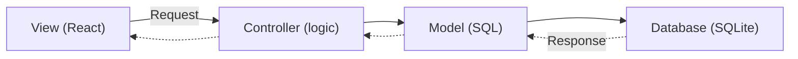

<p align="center">
  
</p>

# BuildItRight

A collection of ready-to-run project templates that teach you how real-world full-stack apps are structured — so you can skip the setup and get straight to building.

> [!NOTE]
> Every project in this repo uses **MVC Architecture** (Model-View-Controller) — the same pattern used by Rails, Django, Laravel, and countless production apps. It keeps code organized, predictable, and easy to modify. More on what that means below.

## What This Is

I built these projects for one reason: most programming students know the concepts but freeze when they have to set up a project from scratch. Where does the database config go? How does the frontend talk to the backend? Why does `npm install` take forever and then nothing works?

This repo answers those questions — not with a theory lecture, but with working code you can run, explore, and hack on.

Each project is a complete, zero-config full-stack app. Install. Run. See something working immediately. Then open the files and trace how it all fits together. The individual READMEs inside each project explain every layer — routes, controllers, models, database, frontend — in plain language.

You know how to write code. I'll help you build the project around it.

---

## Wait — What Is MVC?

You'll hear **MVC** thrown around a lot. It's short for **Model-View-Controller**, and it's just a way of splitting your code into three buckets so it doesn't turn into a tangled mess.

**Model** — talks to the database. It handles saving, loading, querying, and any data logic. If it involves SQL, it lives here.

**Controller** — the brain. It receives a request, asks the model for data, does some processing (check permissions, calculate totals, format things), then sends a response. No SQL, no HTML — just logic.

**View** — what the user sees. In these projects, that's the React frontend. It calls the API, renders buttons and forms, and shows data. No database access, no business logic — just UI.

The flow is always one direction:

1. **View** sends a **request** → **Controller**
2. **Controller** asks **Model** for data
3. **Model** queries the **Database**
4. The **response** flows back the same path (Database → Model → Controller → View)



### Why MVC?

Because it's predictable. When you open a project you've never seen before:

- Need to change how data is saved? Look in **models/**.
- Need to change what happens when someone visits a URL? Look in **controllers/**.
- Need to change what a button does? Look in **client/src/pages/**.

Every project here follows the exact same layout. Learn the pattern once, and you can walk into any of the eight projects and know exactly where to find things. That's the whole point — **spend your time learning, not hunting**.

---

## The Projects

| Project | What It Does | Start Here If... |
|---------|-------------|------------------|
| **ServerBoilerPlate** | A bare-bones Express server with programming exercises as live API endpoints. No frontend — just curl and a terminal. | You want the simplest possible introduction to how servers work. |
| **BasicAuth** | Register, log in, see your profile. Pure authentication explained end to end. | You want to understand how login and registration actually work under the hood. |
| **BasicCrudTODOApp** | A classic todo list — create, read, update, delete — with a database and React frontend. | You want to see how data flows from a form to SQLite and back again. |
| **BasicAiChatBot** | An AI chatbot powered by Groq's free API, with conversation history saved to SQLite. | You want to integrate an external AI API into a full-stack app. |
| **ECommerce** | A single-owner e-commerce storefront with products, cart, and orders — separate owner/customer views. | You want something portfolio-ready with multiple user roles. |
| **LibrarySystem** | Library management with books, members, borrow/return, and overdue tracking. | You want to see related database tables working together in a transactional system. |
| **OnlineVoting** | An online polling system with one-vote-per-person constraints and real-time results. | You're interested in multi-user systems with audit trails. |
| **MovieReviewSite** | Browse 15 classic films, rate them, and write reviews — built with Vue 3 instead of React. | You want to see how Vue 3 connects to an Express backend with the same MVC pattern. |

---

## The Architecture (Shared)

Every project uses the **MVC (Model-View-Controller)** architecture — models handle the database, controllers handle the logic, and the frontend (views) handles what you see. Routes connect the URLs to the right controllers.
Also, every project here follows the same blueprint. Learn one, you've learned them all.

```
ProjectName/
├── server.js              # Express entry point
├── config/
│   └── db.js              # SQLite setup + tables + seed data
├── models/                # Database queries (one file per resource)
├── controllers/           # Request handlers
├── routes/
│   └── routes.js          # URL-to-controller mapping
├── database/              # SQLite files (gitignored)
├── client/                # Vite + React frontend
│   ├── vite.config.js     # Proxies /api to backend
│   └── src/
│       ├── api.js         # Fetch wrapper
│       ├── App.jsx        # Auth + sidebar + routing
│       └── pages/         # One file per page
```

- **Backend** — Express + better-sqlite3. No ORM, no migrations, no async confusion. Just synchronous SQL.
- **Frontend** — Vite + React + Bootstrap. Vite proxies `/api` to the backend — no CORS hassle.
- **One command** — `npm run dev` starts both servers, color-coded, in one terminal.
- **Seed data** — every project has sample records on first run. No empty tables.
- **Debug endpoint** — `GET /api/database` dumps all tables so you can inspect what's happening.

---

## How to Use This Repo

```bash
# 1. Clone the repo
git clone <repo-url> BuildItRight

# 2. Pick a project
cd BuildItRight/BasicCrudTODOApp

# 3. Install dependencies
npm install
npm install --prefix client   # skip if no client/ folder

# 4. Start everything
npm run dev
```

Open `http://localhost:5173` and you'll see it running.

---

## Quick Start Cheat Sheet

| Command | What it does |
|---------|-------------|
| `npm run dev` | Starts backend + frontend together |
| `npm run dev:api` | Starts only the backend |
| `npm run dev:web` | Starts only the frontend |
| `npm start` | Production mode (backend only) |

---

## Troubleshooting

| Problem | Likely Cause | What to Try |
|---------|-------------|-------------|
| `EADDRINUSE: address already in use` | Port 3000 is taken | Change `PORT` in `.env`, update proxy in `vite.config.js` |
| `Cannot find module 'express'` | Backend deps not installed | Run `npm install` |
| `Cannot find module 'react'` | Frontend deps not installed | Run `npm install --prefix client` |
| Blank page at `localhost:5173` | Frontend crashed | Check the Vite output in terminal |
| AI chatbot doesn't reply | No Groq API key | Add `GROQ_API_KEY` in `.env` |
| Two projects crash when both open | Port conflict | Only run one at a time, or change ports |

---

## License

**MIT** — do whatever you want. Build something cool. Share it with a friend. Teach someone else.

---

*"Your first time running this and it crashes? That's normal. Every programmer you look up to started exactly where you are now — staring at a terminal, confused, one Google search away from figuring it out."*

Happy building.
