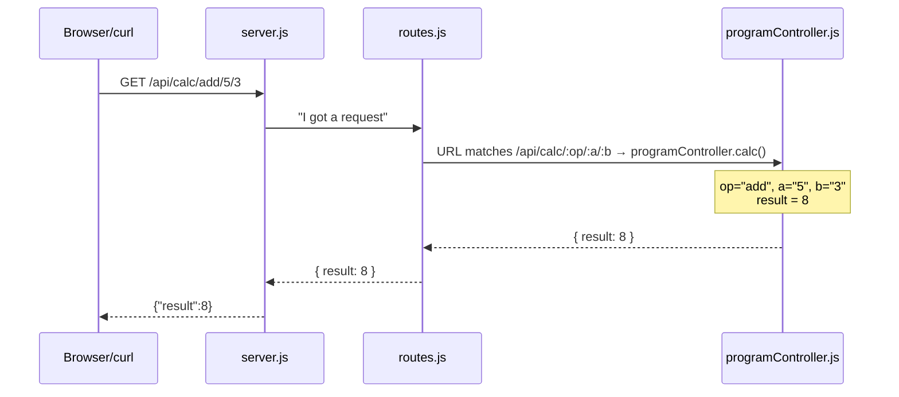

# ServerBoilerPlate

> A friendly server built for learning — every line explained, zero magic, and programming exercises turned into live API endpoints.

You just opened a project that exists for ONE reason: to help you understand how servers work. No hidden config. Just a few files, a handful of routes, and comments written like a human is talking to you. If you've never built a server before, this is your starting line.

---

## What You'll Learn

- How an **Express server** starts, listens for requests, and sends responses
- What **routes** are — how URLs map to code that runs
- How to use **route parameters** (`:id`, `:op`, `:a`, `:b`) to pass data through a URL
- Basic **error handling** — what happens when someone sends a word where a number should go
- How to test an API with **curl** (the terminal command — not a library, just a tool)

---

## Before You Start

- [ ] Node.js v20 or newer? Run `node --version`
- [ ] Have a terminal and a browser?
- [ ] 5 minutes of patience? First install takes a minute.

---

## How Do I Run It?

Open a terminal in this folder and run:

```bash
# 1. Install the dependencies (only once, or when package.json changes)
npm install

# 2. Start the server with auto-reload on every file save
npm run dev
```

You'll see:

```
============================================
  Server running on http://localhost:3000
  Press Ctrl+C to stop
============================================
```

Now open **http://localhost:3000** in your browser. You should see a welcome message.

> **Heads up:** The `.env` file says `PORT=3000`. Both `npm start` and `npm run dev` load `.env` (via `--env-file=.env`). The difference is that `npm run dev` uses nodemon to auto-restart the server when you save files, while `npm start` runs Node directly. So if you change `.env` while the server is running, stop it (Ctrl+C) and restart — even with `npm start`, `.env` is only read at startup.

---

## What's in Here?

```
ServerBoilerPlate/
├── .env                       # PORT=3000 (which port the server listens on)
├── .gitignore                 # Files that should NOT be committed to git
├── nodemon.json               # Tells nodemon how to read .env
├── package.json               # Dependencies, scripts, project info
├── server.js                  # START HERE — the entry point. Read the comments!
│
├── config/
│   └── db.js                  # SQLite database setup (ready for when you add data)
│
├── controllers/
│   └── programController.js   # Five programming exercises, hosted as API endpoints
│
├── models/                    # Your data model files go here (e.g., Message.js)
│
├── routes/
│   └── routes.js              # The URL map — connects URLs to controller functions
│
├── database/                  # SQLite database auto-created here on first run
│
└── README.md                  # You are here
```

### Folder explainer (no jargon, promise)

| Folder | What it does | Real-world analogy |
|--------|-------------|-------------------|
| `config/` | Setup that runs once when the server starts | Plugging in the power cord |
| `controllers/` | Code that handles web requests and runs the logic | The front desk of a hotel |
| `routes/` | The map of which URL goes where | Street signs pointing you to the right building |

---

## How Does It Work?

Every API request follows the same path:



1. **Browser or curl** makes a request to a URL like `/api/calc/add/5/3`.
2. **server.js** catches it at the front door. Middleware runs here (cors, json parsing).
3. **routes/routes.js** recognises the URL pattern and hands it to the right controller function.
4. **controllers/programController.js** takes over. It reads the parameters from the URL, validates them, runs the programming logic, and sends back the answer as JSON.

That's the whole pipeline. Four hops. Every server you'll ever build follows this same flow.

---

## The Database

The database connection is ready to go — your challenge is to create your own tables. The `config/db.js` file has detailed comments explaining every line of the database setup, from creating the connection to defining your schema.

> **Your first task:** Add a `messages` table (a guestbook people can sign). See the Customization Guide below for how to do it. The database is primed and waiting — no setup required beyond writing your `CREATE TABLE` statement.

---

## API Endpoints

| Method | URL | What it does | Teaches |
|--------|-----|-------------|---------|
| `GET` | `/api/calc/:op/:a/:b` | Arithmetic (add, subtract, multiply, divide) | Route params, number conversion, switch/case, edge cases |
| `GET` | `/api/check/even-odd/:num` | Is a number even or odd? | Modulo operator (%), if/else branching |
| `GET` | `/api/check/temperature/:celsius` | Classify a temperature | if / else if / else chains, comparison operators |
| `GET` | `/api/fizzbuzz/:num` | The classic FizzBuzz test | Modulo, combined conditions, ordering of checks |
| `GET` | `/api/check/palindrome/:word` | Does it read the same backwards? | String reversal, method chaining, equality checks |

---

## Try It With curl

Copy and paste these into your terminal. They all work as soon as the server is running.

### Arithmetic

```bash
curl http://localhost:3000/api/calc/add/5/3
curl http://localhost:3000/api/calc/multiply/7/8
curl http://localhost:3000/api/calc/divide/20/5
```

### Odd or even

```bash
curl http://localhost:3000/api/check/even-odd/7
curl http://localhost:3000/api/check/even-odd/42
```

### Temperature classifier

```bash
curl http://localhost:3000/api/check/temperature/0
curl http://localhost:3000/api/check/temperature/22
curl http://localhost:3000/api/check/temperature/38
```

### FizzBuzz

```bash
curl http://localhost:3000/api/fizzbuzz/3
curl http://localhost:3000/api/fizzbuzz/5
curl http://localhost:3000/api/fizzbuzz/15
curl http://localhost:3000/api/fizzbuzz/7
```

### Palindrome check

```bash
curl http://localhost:3000/api/check/palindrome/racecar
curl http://localhost:3000/api/check/palindrome/madam
curl http://localhost:3000/api/check/palindrome/hello
```

### Error cases (these are features, not bugs)

```bash
# Sending a word instead of a number
curl http://localhost:3000/api/calc/add/cat/3
# Dividing by zero
curl http://localhost:3000/api/calc/divide/10/0
```

---

## Tech Stack

| Package | What It Does | Why We Use It |
|---------|-------------|---------------|
| express | HTTP server | Simple, widely used, great for learning |
| better-sqlite3 | Talks to SQLite | Synchronous — no async/await needed for beginners |
| cors | Allows cross-origin requests | So your browser frontend can talk to the API |
| nodemon | Auto-restarts server on save | No more Ctrl+C, npm start, repeat |
| jest | Testing framework | Write tests to make sure your code works (opt-in) |

---

## Customization Guide

### How to add a new calculator operation (like "power" or "modulo")

1. **Open `controllers/programController.js`** and find the `calc` function
2. Inside the `switch (op)` block, add a new `case`:
   ```js
   case 'power':
     result = Math.pow(a, b);
     break;
   ```
3. **Save the file.** Nodemon restarts the server automatically.
4. **Test it:**
   ```bash
   curl http://localhost:3000/api/calc/power/2/8
   ```
5. That's it! You didn't need to touch `routes.js` because the URL pattern `:op/:a/:b` already accepts any operation name.

### How to add a brand-new endpoint (like "BMI calculator")

1. **Open `controllers/programController.js`** and add a new function:
   ```js
   bmi: (req, res) => {
     try {
       const weight = Number(req.params.weight);
       const height = Number(req.params.height);
       const bmi = weight / (height * height);
       res.json({ bmi: Math.round(bmi * 100) / 100 });
     } catch (err) {
       res.status(400).json({ error: err.message });
     }
   },
   ```
2. **Open `routes/routes.js`** and add a new route:
   ```js
   router.get('/check/bmi/:weight/:height', programController.bmi);
   ```
   Put it BEFORE any catch-all routes.
3. **Save both files. Test with curl:**
   ```bash
   curl http://localhost:3000/api/check/bmi/70/1.75
   ```

### How to add a `messages` table to the database

1. **Open `config/db.js`** and add a `CREATE TABLE` statement inside the `db.exec()` call:
   ```js
   db.exec(`
     CREATE TABLE IF NOT EXISTS messages (
       id INTEGER PRIMARY KEY AUTOINCREMENT,
       author TEXT NOT NULL,
       body TEXT NOT NULL,
       created_at TEXT DEFAULT (datetime('now'))
     )
   `);
   ```
2. **Delete the old database** — remove `database/serverboilerplate.sqlite` so the table is created fresh when you restart.
3. **Create a model** — add `models/Message.js` with functions to insert and list messages:
   ```js
   const db = require('../config/db');
   module.exports = {
     getAll: () => db.prepare('SELECT * FROM messages ORDER BY created_at DESC').all(),
     create: (author, body) => db.prepare('INSERT INTO messages (author, body) VALUES (?, ?)').run(author, body),
   };
   ```
4. **Create a controller** — add a handler in `controllers/` and wire it up in `routes.js`.
5. **Test it:**
   ```bash
   curl -X POST http://localhost:3000/api/messages \
     -H "Content-Type: application/json" \
     -d '{"author":"You","body":"Hello, database!"}'
   curl http://localhost:3000/api/messages
   ```

---

## Challenge Yourself

- 🟢 **Easy:** Change the temperature thresholds in the `checkTemperature` function. Make "warm" start at 20°C instead of 25°C.
- 🟢 **Easy:** Add a "modulo" or "power" operation to the calculator (see customization guide above).
- 🟡 **Medium:** Add a "grade classifier" endpoint — send a number, get back "A", "B", "C", "D", or "F".
- 🟡 **Medium:** Create a `messages` table (see Customization Guide) — then build `POST /api/messages` to save a message and `GET /api/messages` to list them.
- 🔴 **Hard:** Add proper error messages for edge cases. What if someone sends a negative number for BMI? What if the name is too long? Validate everything and return helpful 400 errors.

---

## Troubleshooting

| Error | What It Means | What To Try |
|-------|--------------|-------------|
| `EADDRINUSE: address already in use :::3000` | Another app is using port 3000 | Close the other process, or change `PORT` in `.env` to `3001` |
| `Cannot find module 'express'` | You forgot to run `npm install` | Run `npm install` in the project root |
| `Connection refused` in curl | The server isn't running | Run `npm run dev` in another terminal first. We've all done this. |
| `.env` changes not taking effect | `--env-file` is read at startup, not watched for changes | Stop the process (Ctrl+C) and restart it. Both `npm start` and `npm run dev` load `.env`, but `npm run dev` auto-restarts when files change. |
| `curl` hangs with no response | Server is down or blocked | Check the terminal where the server runs. Did it crash? Read the error message. |
| `400` or `500` JSON error response | Invalid input or server crash | Read the error message in the JSON response — it tells you exactly what went wrong |

---

## What Should I Do Next?

1. **Read `server.js` from top to bottom.** Every line has a comment. Don't skip them.
2. **Follow one request all the way through.** Pick `/api/calc/add/5/3` and trace it: `server.js` → `routes.js` → `programController.js`. See how the pieces connect.
3. **Break things on purpose.** Send a word instead of a number to the calc endpoint. See what error you get. Fix it. That's how the learning sticks.
4. **Read `config/db.js`.** It explains databases like a patient teacher. When you're ready to add data storage, you'll know exactly how.
5. **Ready for more?** Move on to **BasicCrudTODOApp** — it adds a React frontend and a real CRUD database to this exact same server pattern.

---

## Production-ish Notes (optional)

- For deployment, run `node --env-file=.env server.js` (Node.js v20+) to load `.env` without nodemon.
- The database and `config/db.js` are ready for you to build on — just add a table, a model, a controller, and a route.
- No build step for the API — it's plain JavaScript. Deploy anywhere that runs Node.js.

---

*"Every programmer you look up to started exactly where you are now — staring at a terminal, confused, one Google search away from figuring it out."*

Your first time running this and it crashes? That's normal. Read the error. Google the first line. Ask someone. You're not supposed to know everything yet. Happy coding.
